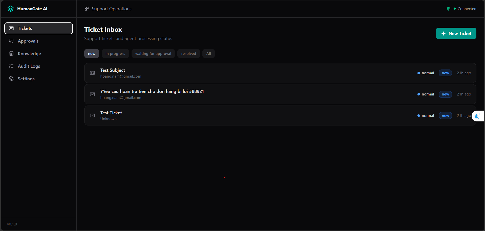

# AI Agent Platform with Human Approval

Human-in-the-loop AI support operations platform with ticket classification, tool calling, guardrails, audit logs, realtime updates, and approval workflows for sensitive actions.



## Current Status

All phases (Phases 0-15) are implemented: planning, infrastructure, database
models, core backend services, guardrails, approval logic, mock tools, LLM
gateway, hybrid RAG retrieval, LangGraph workflow execution, REST/WebSocket
APIs, the React dashboard, and unit/integration/Playwright E2E tests. See
[`docs/PROJECT_BOARD.md`](docs/PROJECT_BOARD.md) for the honest list of known
gaps (no auth, a couple of Settings screens that don't yet affect runtime
behavior, unwired realtime channels) found during the most recent full
review.

## Tech Stack

- Backend: Python, FastAPI, Pydantic v2, SQLAlchemy 2, PostgreSQL, pgvector, Redis.
- Agent workflow: LangGraph.
- Realtime: FastAPI WebSockets, Redis Pub/Sub, Redis Streams.
- LLM: Gemini free-first with Ollama local fallback.
- Frontend: React, TypeScript, Vite, Tailwind CSS v4.

## Documentation

- [Documentation index](docs/README.md)
- [Project checklist](docs/PROJECT_CHECKLIST.md) / [known gaps and backlog](docs/PROJECT_BOARD.md)
- [Architecture](docs/ARCHITECTURE.md) — service boundaries, event flow, and where things actually run
- [Data model](docs/DATA_MODEL.md)
- [API design](docs/API_DESIGN.md)
- [Agent workflows](docs/AGENT_WORKFLOWS.md) — the two LangGraph graphs, node by node
- [Guardrails and approvals](docs/GUARDRAILS_AND_APPROVALS.md)
- [Tech stack](docs/TECH_STACK.md)
- [LLM and retrieval](docs/LLM_AND_RETRIEVAL.md)
- [Mock tools](docs/MOCK_TOOLS.md)
- [Frontend spec](docs/FRONTEND_SPEC.md)

The docs above describe the system as it actually behaves today, including
known gaps (e.g. no auth, some Settings screens are not fully wired to
runtime behavior) rather than the original aspirational design — see each
doc for specifics and [`docs/PROJECT_BOARD.md`](docs/PROJECT_BOARD.md) for the
consolidated list.

## Quickstart

Create a local `.env` from the example:

```powershell
Copy-Item .env.example .env
```

Start the core infrastructure:

```powershell
docker compose up -d postgres redis
```

Start all local services:

```powershell
docker compose up --build
```

Run database migrations and seed demo data:

```powershell
docker compose exec api alembic upgrade head
docker compose exec api python -m app.db.seed
```

API health:

```text
http://localhost:8000/health/live
http://localhost:8000/health/ready
```

Frontend:

```text
http://localhost:5173
```

Optional local LLM profile:

```powershell
docker compose -f docker-compose.yml -f docker-compose.local-llm.yml --profile local-llm up -d ollama
```

## GitHub

Repository target:

```text
https://github.com/wsunicorn/AI-Agent-Platform-with-Human-Approval.git
```
