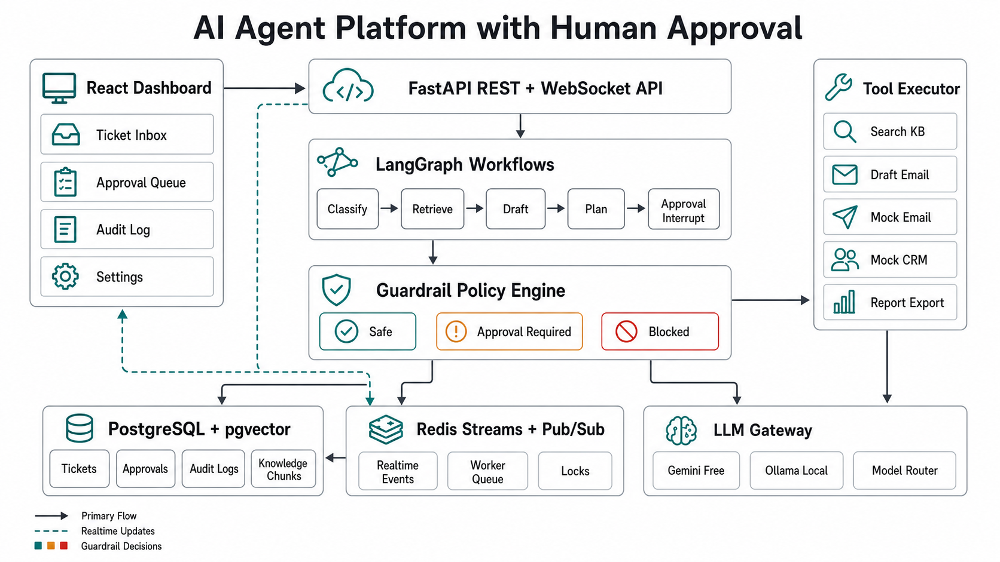

# Architecture



This document describes the system as it is actually built, not as it was
originally planned. Where the real implementation diverges from the simplest
mental model, that divergence is called out explicitly.

## High-Level Architecture

```text
React Dashboard
  | REST
  | WebSocket
  v
FastAPI API process
  | creates tickets and agent runs
  | runs LangGraph workflows as background tasks (same process)
  | manages approvals and executes approved tools
  | serves audit logs
  v
LangGraph Workflow Runner (in-process, via FastAPI BackgroundTasks)
  | emits audit events
  | calls tools through the Guardrail Policy Engine
  | creates approval requests, then the graph run ends
  v
Guardrail Policy Engine
  | unregistered -> deny
  | safe -> execute
  | approval_required -> approval queue
  | blocked -> deny
  v
Tool Executor
  | validates input/output with Pydantic
  | logs every attempt to tool_calls + audit_logs
  v
Mock Integrations (email, CRM notes, report export)

PostgreSQL + pgvector stores durable state.
Redis Pub/Sub broadcasts live updates to WebSocket clients.
```

## Services (as deployed by `docker-compose.yml`)

### `api`

A single FastAPI process (`app/main.py`) that does most of the real work:

- Exposes all REST APIs (`app/api/*.py`) and WebSocket endpoints (`app/api/websockets.py`).
- Creates tickets and agent runs.
- **Runs LangGraph workflows itself**, as a `BackgroundTasks` coroutine
  (`app/api/agent_runs.py:_run_support_agent` / `_run_workflow_agent`), not in a
  separate worker process.
- **Executes approved sensitive actions synchronously**, inside the
  `POST /approvals/{id}/execute` request handler
  (`app/api/approvals.py:execute_approved` → `ToolExecutor.execute_approved`).
- Publishes audit/lifecycle events to Redis Pub/Sub and forwards them to
  connected WebSocket clients via an in-process listener task
  (`app/api/websockets.py:redis_event_listener`).
- There is no authentication/authorization layer yet. Every reviewer action is
  attributed to the client-supplied `reviewer` field (the frontend hardcodes
  `"admin"`); there is no session or user identity model.

### `worker`

`app/workers/worker.py` is currently a minimal standalone process: on startup
it registers the mock tools, checks Postgres/Redis connectivity, and then
loops on a 30-second heartbeat. **It does not consume a job queue.** `arq` is
listed in `requirements.txt` but nothing in `app/` creates an ARQ queue, worker
pool, or job definitions — the dependency is present for future use, not wired
up. If you need a real background-job story (e.g. long-running ingestion, or
moving workflow execution off the API process), this is the natural place to
add it, but today the `worker` container is not on the critical path of any
feature.

### `web`

- Renders the React dashboard (`frontend/src`).
- Talks to the API over REST (`frontend/src/lib/api.ts`) and three WebSocket
  channels (`frontend/src/lib/websocket.ts`).
- Has no client-side router: navigation between screens is in-memory
  `useState` view-switching in `frontend/src/app/App.tsx`, so there are no
  deep-linkable URLs and a page reload always returns to the ticket inbox. See
  [`FRONTEND_SPEC.md`](FRONTEND_SPEC.md) for detail.

### `postgres`

Stores tickets, agent runs, tool calls, approval requests, audit logs,
knowledge documents/chunks, and model configs. Built from `postgres.Dockerfile`
so the pgvector extension is available without depending on an external image.
See [`DATA_MODEL.md`](DATA_MODEL.md) for the full schema.

### `redis`

- Pub/Sub channel `humangate.events` (configurable) for live dashboard updates.
- Redis Streams (`humangate:events`, capped at `redis_events_stream_maxlen`)
  for durable event history, written alongside every Pub/Sub publish.
- Distributed lock (`RedisLock`, Lua-scripted token release) to prevent an
  approved sensitive action from executing twice under concurrent requests.

Redis Streams are written by `EventService.publish` but nothing in the
codebase currently reads them back — there is no stream-replay/backfill path.
The stream is future-facing durability, not an active feature yet.

## Event Flow

```text
AuditService.record() / EventService.publish()
-> event envelope written to the Redis Stream (durable history)
-> event envelope published to the Redis Pub/Sub channel
-> app.api.websockets.redis_event_listener (background task in the api process)
   reads the Pub/Sub message and re-broadcasts it to the matching
   WebSocketManager topic(s): the run's `/ws/agent-runs/{run_id}` topic,
   `/ws/approvals` if it is an approval event, and always `/ws/notifications`
-> connected browser tabs receive the JSON event and invalidate their
   TanStack Query caches to refetch durable state
```

There is no dedicated `agent_run.*` / `tool_call.*` event emitter distinct from
audit logging: `AuditService.record` is the single event source, and the
WebSocket listener unpacks `audit_log.created` envelopes to recover the
original event type before rebroadcasting. See
[`CORE_BACKEND_SERVICES.md`](CORE_BACKEND_SERVICES.md).

## Approval Execution Flow

```text
agent proposes a tool action (LangGraph node calls ToolExecutor.execute)
-> PolicyEngine.decide() classifies the tool by name
-> unregistered tool -> denied immediately, no tool_calls row
-> registered + approval_required -> tool_calls row (waiting_for_approval)
   + approval_requests row (pending_review), audit event published
-> LangGraph run ends (create_approval_requests -> END); nothing keeps
   the graph "paused" in memory or on a checkpoint
-> reviewer calls POST /approvals/{id}/approve | /reject | /edit
   (ApprovalService, row-locked via SELECT ... FOR UPDATE)
-> reviewer calls POST /approvals/{id}/execute
-> ToolExecutor.execute_approved acquires a Redis lock, re-validates the
   approval status under the DB row lock, executes the tool with the
   approved/edited payload, and marks the approval executed or failed
-> tool_calls and audit_logs record the outcome
```

**Important nuance:** although `app/agents/support_graph.py` and
`app/agents/workflow_graph.py` both define an `execute_approved_tools` node
(and `support_graph.py` even defines a `_has_approved_actions` router
function for it), **no edge in either compiled graph ever reaches that
node** — nothing sets `state["approved_actions"]`, and the conditional
edge that would route to it is never wired with `add_conditional_edges`.
Approval execution in the running system happens entirely through the code
path above (`app/api/approvals.py` → `ToolExecutor.execute_approved`), which
is a plain service call, not a resumed LangGraph run. The graph node is dead
code today; treat "LangGraph resumes after approval" as aspirational, not
descriptive.

## Architecture Rules

- The LLM may propose actions, but it never decides final execution permission.
- Policy decisions happen in `app/guardrails/policy.py`, driven by the mutable
  `TOOL_SENSITIVITY_CATALOG` dict (seeded from the safe/approval/blocked name
  sets in `app/guardrails/catalog.py`, and updatable at runtime through the
  `/settings/tools` and `/settings/guardrail-policies` endpoints).
- All tool inputs and outputs are Pydantic-validated (`app/tools/mock_tools.py`
  models, enforced by `ToolExecutor`).
- All sensitive actions require a server-side approval check
  (`ToolExecutor.execute` refuses direct execution of `approval_required`
  tools; only `execute_approved` can run them, and only from `approved`/`edited`
  state).
- Redis accelerates realtime behavior and prevents duplicate execution;
  PostgreSQL remains the source of truth. A dropped WebSocket connection loses
  nothing — the client re-fetches durable state through the REST API.
- Only two tools are actually approval-required *and* implemented end-to-end
  today: `send_email` and `export_report`. The remaining catalog names
  (`update_ticket_status`, `trigger_refund_request`, `post_slack_message`, and
  every `blocked` name) have no registered `ToolDefinition`, so calling them
  is denied as "unregistered", never reaches the approval or blocked branch in
  practice. See [`GUARDRAILS_AND_APPROVALS.md`](GUARDRAILS_AND_APPROVALS.md).
